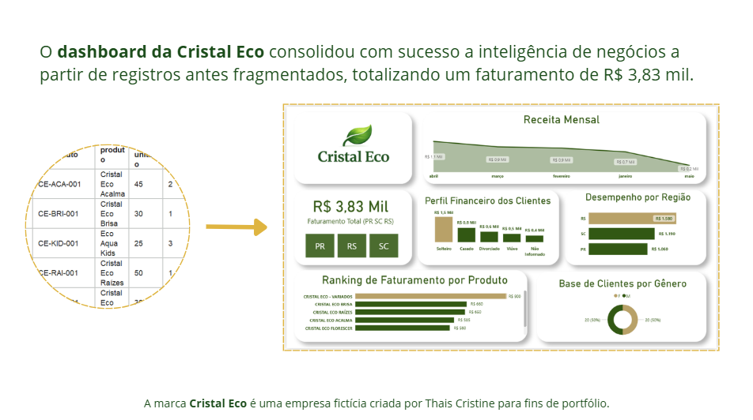

# 🌿 Cristal Eco - Dashboard de BI

Este projeto de Business Intelligence foi desenvolvido para a marca **Cristal Eco**, com o objetivo de reconstruir a inteligência estratégica de dados após uma falha sistêmica que resultou na perda de registros estruturados e comprometeu a análise de performance do negócio.

## 📊 Visualização do Projeto

## 🎯 Sobre o Projeto
O desafio principal foi atuar na recuperação e tratamento de dados brutos, dispersos e desorganizados. O projeto focou em transformar fragmentos de informações em uma base sólida de indicadores, permitindo a análise de performance e a tomada de decisão estratégica para uma empresa do setor de produtos de limpeza sustentáveis.

## 🛠️ Tecnologias e Habilidades Aplicadas
* **Ferramenta:** Microsoft Power BI.
* **Tratamento de Dados:** Power Query (Limpeza de dados brutos, padronização e criação de dCalendario).
* **Modelagem:** Estrutura em *Star Schema* (tabela fato `fVendas` e dimensões) para alta performance e eliminação de redundâncias.
* **Análise:** KPIs de Faturamento Total (R$ 3,83 mil), Performance Regional, Sazonalidade (Receita Mensal), Ranking de Produtos e Perfil de Clientes.
* **Design:** Aplicação de UX/UI minimalista para facilitar a leitura de indicadores estratégicos.

## 📄 Documentação Técnica
Para mais detalhes sobre o processo de ETL, tratamento de dados, modelagem *Star Schema* e a estratégia dos indicadores, acesse a documentação oficial do projeto:
[Clique aqui para baixar a Documentação Técnica (PDF)](relatorio_tecnico_cristal_eco.pdf).

## 🚀 Como visualizar
1. Baixe o arquivo `analise_comercial_cristal_eco.pbix`.
2. Abra no Power BI Desktop.
3. Explore os filtros interativos e os indicadores de performance.

---
*Projeto desenvolvido como parte do seu portfólio pessoal.*
*Analista: Thais Cristine*
